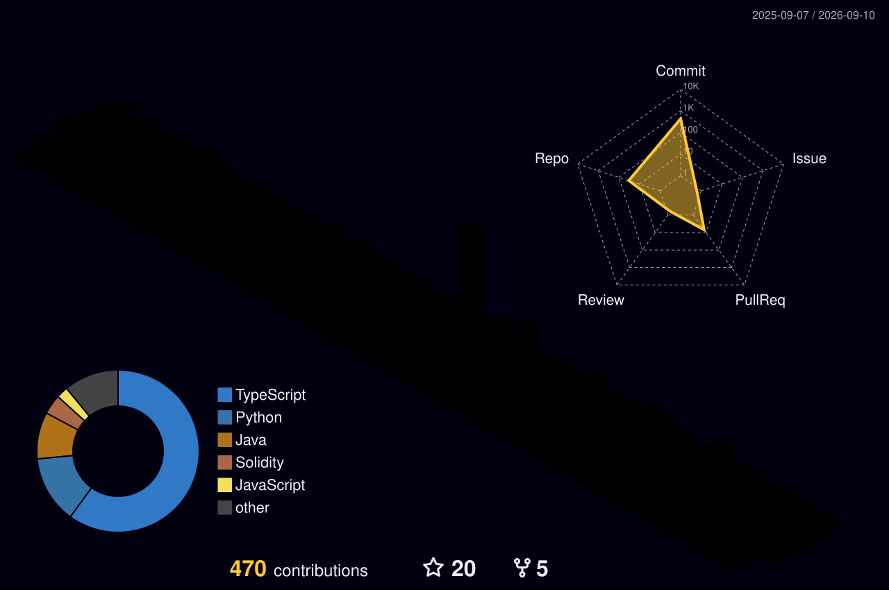

  

<h1 align="center">Yashasvi Singh Rajput</h1>

Full Stack Developer | AIML Undergraduate

## About

AI/ML undergraduate (B.Tech, 2028) with strong foundations in DSA, OOP, and Java-centric development. I build clean web and backend systems that solve real problems.

## Tech Stack

  

## Highlights

- Java, Python, C++, JavaScript, SQL
- Spring MVC, REST APIs, React.js
- MySQL, MongoDB, GitHub, Postman
- Hackathon winner and AI patent author

## GitHub Stats

  

  

## 3D Contribution Graph

  

