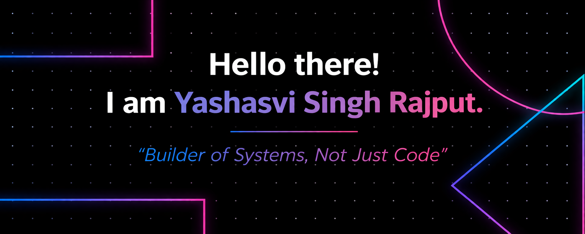
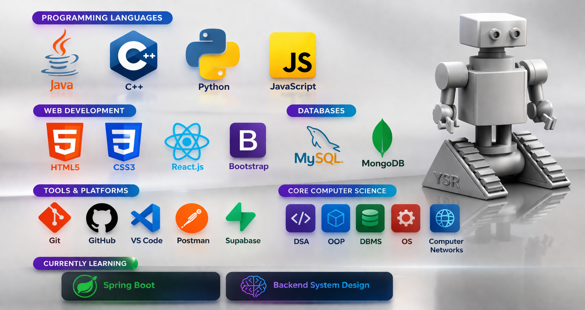

---

  

---

<h1 align="center">Hi 👋 I'm Yashasvi Singh Rajput</h1>

Full Stack Developer | AI/ML Undergraduate 🚀

---

# 💡 What do I know?

* #### 🚀 Full Stack Development (React + Java Backend)
* #### 🤖 AI/ML Development & Intelligent Systems
* #### 🧠 Strong in DSA, OOP, DBMS, OS, Computer Networks
* #### 🏆 Hackathon Builder & Competitive Programmer

---

# 💻 My Tech-Stack

---

# ⚡ My Projects

- 🍽️ Food Court Management System (Java, OOP)
- 🔗 Client-Server System (Socket Programming)
- 🤖 AI Citizen Services Portal
- 🎉 Plan My Event (Full Stack Platform)
- 🌐 GDG OIST Web Platform

---

# 🏆 Achievements

- 🥈 2nd Runner-Up – Google Developer Hackathon  
- 🥇 1st Prize – Bhopal DAO Buildathon  
- 🚀 SIH 2025 Finalist  
- 🧠 Selected in MANIT Hackathon (Top 21/1000+)  
- 📜 Indian Patent Published (AI Drone System)

---

# 🎬 Dev Vibes

---

# 🧠 What I Focus On

- Backend Engineering (Java + Spring Boot)  
- Full Stack Development (React.js)  
- Database Systems (MySQL, MongoDB)  
- AI/ML + Automation  

---

# ⚡ Fun Facts / Hobbies

### - Competitive Coding (LeetCode / Codeforces)  
### - Organizing Tech Events (GDG OIST)  
### - Exploring AI deeply 🤖  

---

# 🌐 Where to find me?

---

# 📌 Featured Work

---

---

✨ Building scalable systems, not just writing code ✨

